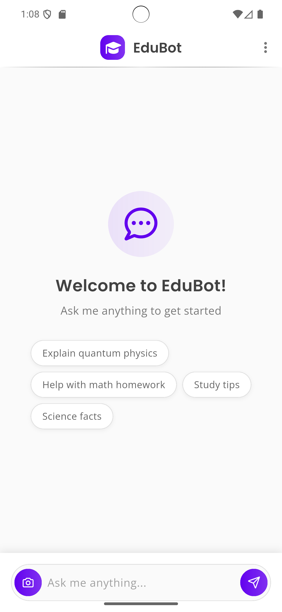

# Chat Application with EduBot

A Flutter-based chat application that allows users to interact with an intelligent bot named EduBot. The application features a clean user interface, real-time message updates, and support for text and image messages.

## Features

*   **User-Bot Interaction:** Engage in conversations with EduBot.
*   **Text Messaging:** Send and receive text messages.
*   **Image Messaging:** Send images to the bot (and potentially receive them, though this part isn't fully clear from the snippet).
*   **Real-time Updates:** Messages appear in the chat interface as they are sent and received.
*   **Timestamped Messages:** Each message clearly shows when it was sent or received.
*   **Typing Indicator:** Shows when EduBot is composing a reply.
*   **Error Handling:** Displays error messages from the bot in a distinct way.
*   **Animated UI:** Smooth animations for new messages appearing.
*   **Customizable Theme:** Uses the application's theme for styling.

## Screenshots

<!-- Example:

-->

## Technologies Used

*   **Flutter:** For building the cross-platform mobile application.
*   **Dart:** Programming language used for Flutter development.
*   **Provider:** For state management (as seen with `ChatController` and `Consumer`).
*   **google_fonts:** For custom fonts in the UI.
*   **font_awesome_flutter:** For icons.
*   **intl:** For date formatting (timestamps).
*   **permission_handler:** For requesting necessary device permissions (like photo library access).
    <!-- Add any other significant packages or backend technologies you are using, e.g., Firebase, a specific AI API for EduBot, etc. -->

## Project Structure (Key Components)

*   `lib/`
    *   `viwe/Home/home_page.dart`: Contains the main UI for the chat screen.
    *   `controller/chat_controller.dart`: (Assumed) Manages the chat logic, messages, and interaction with the bot.
    *   `model/message_model.dart`: (Assumed) Defines the structure for chat messages.
        <!-- Add other important directories or files -->

## Getting Started

### Prerequisites

*   Flutter SDK: [Installation Guide](https://flutter.dev/docs/get-started/install)
*   Dart SDK
*   An IDE like Android Studio or VS Code with the Flutter plugin.
    <!-- List any other prerequisites, like API keys if your bot needs them -->

    
